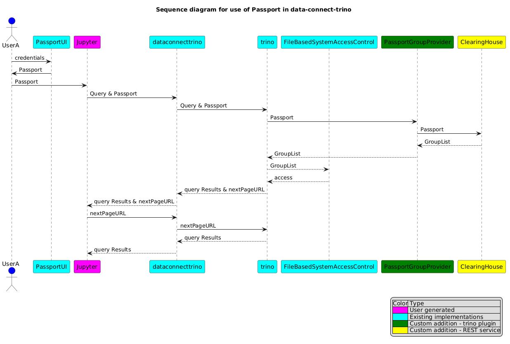

#  ga4gh-passport-groupprovider

An implementation of a Trino GroupProvider plugin that accepts a GA4GH Passport as a 'user'. It implements the getGroups(user) method of GroupProvider by calling a Passport Clearing House which validates the Passport and returns the list of visas which the Passport contains.

This is typically deployed using Trino [File-based Access Control](https://trino.io/docs/current/security/file-system-access-control.html). The DataConnect/Trino catalogs, schemas and tables to which the Passport grants access are specified in a rules file - using the group field. Group names used in the rules file should be the same as the names returned by the Clearing House. These names are the visa names in the Passport. This provides a straightforward mapping of visas to the DataConnect/Trino objects to which they grant access.

See Trino documentation for full explanation of [Trino security](https://trino.io/docs/current/security/overview.html) and the role of a GroupProvider. Development of a GroupProvider plugin is covered at [GroupProvider](https://trino.io/docs/current/develop/group-provider.html).

## Context
The following sequence diagram shows the PassportGroupProvider plugin within the overall context of Data Connect and Trino

## Build

    ./mvnw clean package dependency:copy-dependencies

## Docker

A simple deployment for exploration can be done using the [trino Docker](https://trino.io/docs/current/installation/containers.html) image provided by trino.

A Docker image can be created using the Dockerfile provided in the project root directory. This copies the plugin and and dependencies to a ga4gh-passport-groupprovider folder in the trino plugins folder in the Docker image.

    docker build .

The default trino catalogs are removed from this Docker image. You should add the catalogs you require to your Docker container.

## Deployment

It would typically be expected that a Clearing House would run on the same internal network as the Trino implementation.

## Configuration
Provide the URL at which the Clearing House is running.

Follow the Trino instructions for [configuration](https://trino.io/docs/current/security/file-system-access-control.html#configuration) of File-based access control

## Changelog

## Maintainers

* 
